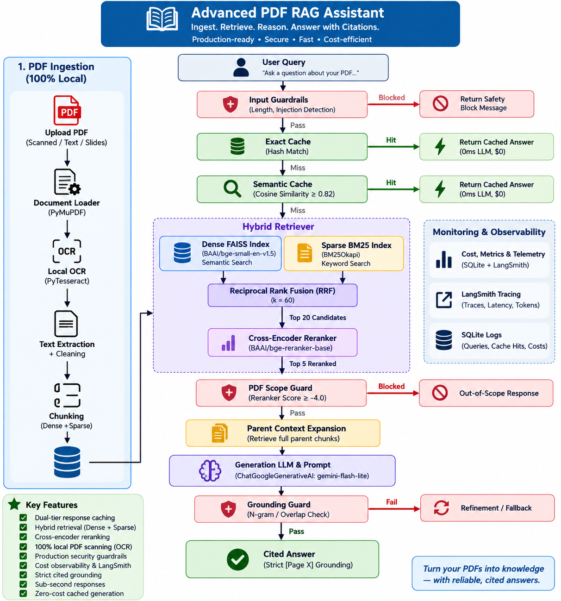

# Production-Grade Advanced PDF RAG Assistant (`pdf_rag_bot`)

A complete, production-ready Advanced Retrieval-Augmented Generation (RAG) system with dual-tier response caching, cost observability, production security guardrails, 100% local PDF scanning, and LangSmith telemetry. Capable of ingesting arbitrary PDF documents (including scanned pages, slide decks, diagrams, tables, and academic lecture notes) with strict cited grounding, sub-second responses, and zero-cost cached generation.

---

## 🏛️ System Architecture



> 📖 For comprehensive technical specifications, deep-dive component descriptions, and subsystem flows, see **[docs/ARCHITECTURE.md](docs/ARCHITECTURE.md)**.

```
                                USER QUERY
                                    │
                                    ▼
                         ┌────────────────────┐
                         │  INPUT GUARDRAILS  │ ── Blocked ──► Return Safety Block Message
                         │ (Length, Injection)│
                         └──────────┬─────────┘
                                Pass │
                                    ▼
                         ┌────────────────────┐
                         │    EXACT CACHE     │ ── Hit ──► Return Cached Answer (0ms LLM, $0)
                         └──────────┬─────────┘
                                Miss │
                                    ▼
                         ┌────────────────────┐
                         │   SEMANTIC CACHE   │ ── Hit ──► Return Cached Answer (0ms LLM, $0)
                         │  (Cosine >= 0.82)  │
                         └──────────┬─────────┘
                                Miss │
                                    ▼
                             HYBRID RETRIEVER
                      ┌──────────────┴──────────────┐
                      ▼                             ▼
               Dense FAISS Index             Sparse BM25 Index
            (BAAI/bge-small-en-v1.5)           (BM25Okapi)
                      │                             │
                      └──────────────┬──────────────┘
                                     │
                      [Reciprocal Rank Fusion (RRF k=60)]
                                     │
                                     ▼ (Top 20 Candidates)
                          CROSS-ENCODER RERANKER
                          (BAAI/bge-reranker-base)
                                     │
                                     ▼ (Top 5 Reranked)
                         ┌────────────────────┐
                         │  PDF SCOPE GUARD   │ ── Blocked ──► Out-of-Scope Response
                         │ (Reranker >= -4.0) │
                         └──────────┬─────────┘
                                Pass │
                                     ▼
                          PARENT CONTEXT EXPANSION
                                     │
                                     ▼
                           GENERATION LLM & PROMPT
                  (ChatGoogleGenerativeAI: gemini-flash-lite)
                                     │
                                     ▼
                         ┌────────────────────┐
                         │  GROUNDING GUARD   │ ── Fail ──► Refinement / Fallback
                         │  (N-gram / Overlap)│
                         └──────────┬─────────┘
                                Pass │
                                     ▼
                         ┌────────────────────┐
                         │  COST, METRICS &   │
                         │SECURITY TELEMETRY  │ ──► Persist to SQLite & LangSmith
                         └──────────┬─────────┘
                                     │
                                     ▼
                                CITED ANSWER
                         (Strict [Page X] Grounding)
```

---

## 📁 Project Structure

```
pdf_rag_bot/
│
├── README.md                      # Complete system documentation
├── requirements.txt               # Pinned dependencies
├── .env.example                   # API & LangSmith configuration template
├── main.py                        # Single-command CLI runner & evaluation benchmark
├── app.py                         # 6-Page interactive Streamlit Web UI
│
├── docs/
│   ├── ARCHITECTURE.md            # Detailed system architecture specification
│   └── architecture.png           # High-resolution system architecture diagram
│
├── data/
│   └── sample_document.pdf        # Knowledge base PDF
│
├── src/
│   ├── __init__.py                # Module exports
│   ├── config.py                  # System configuration, pricing, hardware detection & guardrail settings
│   ├── document_loader.py         # PyMuPDF + Ligature Decoding + Local PyTesseract OCR (100% Local Scanning)
│   ├── indexer.py                 # Chunker, FAISS dense vector store & BM25 sparse indexer
│   ├── models.py                  # Model Registry (BGE Embedder, Cross-Encoder, Gemini LLM)
│   ├── retrieval.py               # Dense, BM25, RRF Hybrid Fusion (k=60), Reranker & Query Rewriter
│   ├── generation.py              # Parent context expansion, prompt construction & system prompt hardening
│   ├── caching.py                 # Exact & Semantic Cache Manager (SQLite + SHA256 document hashing)
│   ├── guardrails.py              # Modular Guardrails Layer (Length, Injection, Scope, Grounding)
│   ├── metrics.py                 # Persistent request metrics, cost calculation & security telemetry logger
│   ├── evaluator.py               # Benchmark evaluation suite (Recall@5, Recall@10, MRR@10, nDCG@10)
│   └── pipeline.py                # High-level RAGPipeline wrapped with caching, guardrails & LangSmith tracing
│
├── tests/
│   ├── test_caching_and_metrics.py# Caching & metrics unit tests
│   └── test_guardrails.py         # Security & guardrails test suite (11 test scenarios)
│
└── artifacts/                     # Persisted SQLite databases, vector stores & reports
    ├── rag_cache.db               # SQLite exact & semantic response cache database
    ├── rag_metrics.db             # SQLite request telemetry, cost & guardrail database
    ├── faiss/                     # Vector index cache
    └── bm25/                      # BM25 pickle cache
```

---

## 🚀 Quick Start

### 1. Configure Environment Variables
Create or update your `.env` file:
```bash
GOOGLE_API_KEY=your_gemini_api_key_here

# LangSmith Observability (Optional)
LANGCHAIN_TRACING_V2=true
LANGCHAIN_ENDPOINT="https://api.smith.langchain.com"
LANGCHAIN_API_KEY=your_langsmith_api_key_here
LANGCHAIN_PROJECT="Chat-bot"
```

### 2. Run Automated Test Suite
Verify caching, guardrails, security protections, similarity thresholds, document isolation, empty query blocking, and cost calculations:
```bash
python -m unittest discover -s tests
```

### 3. Launch Interactive Streamlit UI
```bash
streamlit run app.py
```
*(Or from the main repository directory: `..\.venv\Scripts\streamlit run app.py`)*

---

## 💻 Streamlit UI Navigation

1. **💬 Chat**: Interactive QA with direct `[Page X]` citation badges, source preview expanders, guardrail status warnings, and instant cache badges (`⚡ Exact Cache Hit`, `🧠 Semantic Cache Hit`, `🔥 Live LLM`).
2. **💰 Cost & Usage**: Metric cards (Requests, Hit Rate %, Exact/Semantic Hits, Tokens, LLM Cost $, Est. Savings $, Guardrail Blocks, Grounding Passes/Failures), Security Telemetry breakdown, recent request telemetry table, and Plotly distribution & cumulative cost charts.
3. **🔍 Retrieval Debug**: Side-by-side inspection of BM25 scores, Dense cosine distances, RRF fused rankings, and Cross-Encoder re-scores.
4. **📊 Evaluation**: Live benchmark metrics comparison (Recall@5, Recall@10, MRR@10, nDCG@10).
5. **📈 Analytics**: Real-time latency profiling broken down per pipeline stage (ms/sec).
6. **⚙️ Settings**: Hardware diagnostics, model inspectability, cache threshold slider (`0.82`), Guardrail toggles (Prompt Injection, PDF Scope, Grounding Check), and secret configurations.

---

## 🛡️ Guardrails & Security Architecture

- **Query Length & Empty Query Validation**: Enforces maximum input length (`MAX_QUERY_LENGTH = 2000` chars) and blocks empty/whitespace-only queries before any vector embedding or retrieval operations occur.
- **Prompt Injection Detection**: Deterministic regex pattern matching catches common jailbreak patterns, system prompt overrides, and instruction overrides (`"ignore previous instructions"`, `"system override"`, etc.) without incurring extra LLM cost or latency.
- **PDF Scope Validation**: Validates top candidate relevance using Cross-Encoder logits (`pdf_scope_threshold = -4.0`). If candidates are irrelevant, blocks LLM generation immediately with a clean out-of-scope response, reusing candidate reranker scores with **zero duplicate vector queries**.
- **System Prompt Hardening**: Frames retrieved PDF context strictly as untrusted reference data with explicit instructions to ignore embedded user instructions found within document text (indirect prompt injection defense).
- **Output Grounding Validation**: Performs n-gram and token overlap verification between LLM response claims and retrieved parent chunks to prevent hallucination or ungrounded responses.
- **Security Telemetry**: All guardrail triggers (`input-blocked`, `out-of-scope`, `grounding-fail`, `passed`) are persisted into SQLite (`artifacts/rag_metrics.db`) and logged to LangSmith with specialized tags (`input-blocked`, `prompt-injection`, `out-of-scope`, `grounding-fail`, `grounding-pass`).

---

## ⚡ Response Caching & Observability

- **Exact Response Cache**: SHA256 string hashing on input queries returns instant cached responses (`0ms LLM latency`, `$0 cost`).
- **Semantic Response Cache**: Cosine similarity search over cached query vectors scoped strictly to the current PDF document hash. Matches above threshold (`0.82`) short-circuit the LLM call with **$0 cost**.
- **Document Version Scoping**: SHA256 PDF content hashing guarantees old cache entries are automatically invalidated when a document is updated or replaced.
- **Cost Calculation**: Automated token usage tracking (`input_tokens`, `output_tokens`) using real provider API metadata or fallback tokenizers, multiplied by per-model pricing configuration.
- **LangSmith Tracing**: Full OpenTelemetry request tracing with dynamic tags (`pdf-rag`, `cache-hit`, `cache-miss`) and metadata attributes (`llm_skipped`, `document_id`, `cache_type`).
